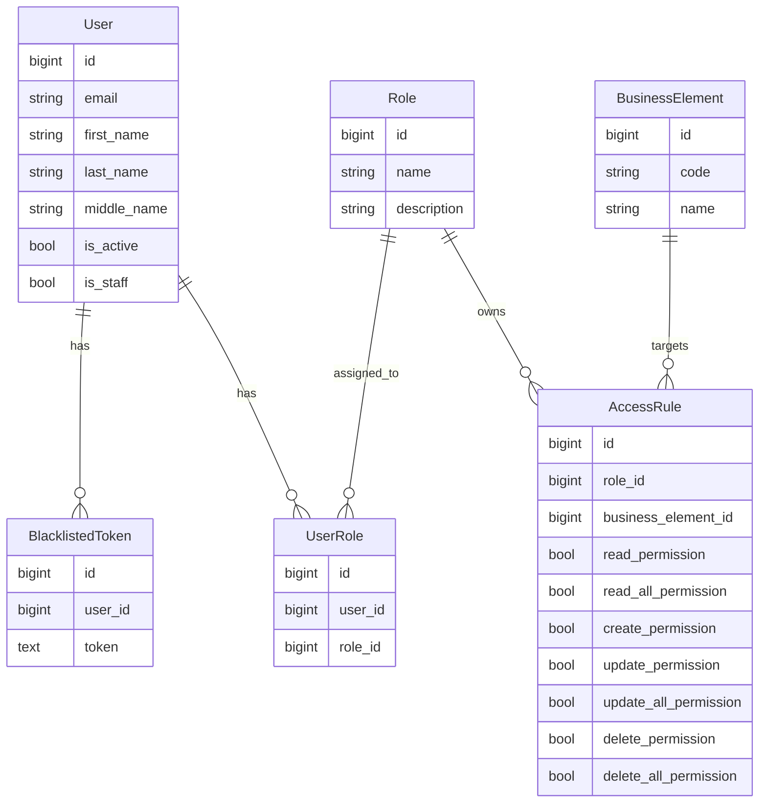

# TZ Mobile Backend

Простой backend на Django + DRF + PostgreSQL для тестового задания.

В проекте есть:

- регистрация и логин по `email`
- JWT access token без готовой "магии" вроде `simplejwt`
- кастомная Bearer authentication
- logout через blacklist токенов
- soft delete аккаунта
- простая RBAC-схема с ролями и правилами доступа
- mock endpoints для `products`, `stores`, `orders`
- admin API для просмотра и изменения `access rules`

## Authentication и Authorization

Это две разные вещи:

- `authentication` отвечает на вопрос: "кто это?"
- `authorization` отвечает на вопрос: "что этому пользователю можно делать?"

В этом проекте это работает так:

1. Пользователь логинится по `email` и `password`.
2. Сервер создаёт JWT token, в котором лежит `user_id`.
3. В следующих запросах клиент передаёт заголовок `Authorization: Bearer <token>`.
4. Кастомная аутентификация достаёт токен, проверяет подпись, ищет пользователя и кладёт его в `request.user`.
5. После этого уже можно проверять права доступа по ролям и `AccessRule`.

Итог:

- authentication = понять, какой это пользователь
- authorization = проверить, разрешено ли ему это действие

## Как устроены основные модели

### User

Кастомная модель пользователя.

Поля:

- `first_name`
- `last_name`
- `middle_name`
- `email`
- `password`
- `is_active`
- `is_staff`
- `created_at`
- `updated_at`

Логин идёт по `email`.

### BlacklistedToken

Хранит JWT токены, которые стали недействительными после logout или удаления аккаунта.

Если токен есть в этой таблице, кастомная Bearer authentication не считает пользователя аутентифицированным.

### Role

Роль пользователя.

В проекте есть тестовые роли:

- `admin`
- `manager`
- `user`
- `guest`

### BusinessElement

Сущность, к которой применяются правила доступа.

Сейчас используются:

- `users`
- `products`
- `stores`
- `orders`
- `access_rules`

### AccessRule

Связка:

- роль
- business element
- набор permission-флагов

Поля прав:

- `read_permission`
- `read_all_permission`
- `create_permission`
- `update_permission`
- `update_all_permission`
- `delete_permission`
- `delete_all_permission`

### UserRole

Связь пользователя с ролью.

Один пользователь может иметь несколько ролей.

## Схема БД



## Как работает регистрация

Endpoint: `POST /api/auth/register/`

Принимает:

- `first_name`
- `last_name`
- `middle_name`
- `email`
- `password`
- `password_repeat`

Что происходит:

1. Проверяется совпадение `password` и `password_repeat`.
2. Проверяется уникальность `email`.
3. Создаётся пользователь.
4. Пароль хешируется через `set_password()`.

## Как работает login

Endpoint: `POST /api/auth/login/`

Принимает:

- `email`
- `password`

Что происходит:

1. Находим пользователя по `email`.
2. Проверяем пароль.
3. Проверяем, что пользователь активен (`is_active=True`).
4. Создаём JWT token на основе `user.id`.
5. Возвращаем token и краткую информацию о пользователе.

Пример заголовка для следующих запросов:

```http
Authorization: Bearer <token>
```

## Как определяется пользователь по Bearer token

Кастомная аутентификация:

1. Берёт заголовок `Authorization`.
2. Проверяет, что он начинается с `Bearer`.
3. Достаёт token.
4. Проверяет, что токен не находится в blacklist.
5. Декодирует JWT.
6. Берёт `user_id` из payload.
7. Ищет активного пользователя в БД.
8. Подставляет пользователя в `request.user`.

Если токен битый, просроченный, blacklisted или пользователь не найден, запрос считается неаутентифицированным.

## Как работает logout

Endpoint: `POST /api/auth/logout/`

Что происходит:

1. Берётся текущий Bearer token.
2. Токен сохраняется в таблицу `BlacklistedToken`.
3. После этого этот token больше нельзя использовать.

## Как работает удаление аккаунта

Endpoint: `DELETE /api/users/me/`

Это мягкое удаление.

Что происходит:

1. Текущий token попадает в blacklist.
2. Пользователь получает `is_active=False`.
3. Запись в БД остаётся.
4. Повторный login такого пользователя запрещён.

## Как устроены роли и права доступа

Права проверяются через сервис в `users/services.py`.

На вход подаётся:

- пользователь
- `business_element_code`
- действие: `read`, `create`, `update`, `delete`

Логика простая:

1. Если пользователь не аутентифицирован, возвращается `401`.
2. Берутся все роли пользователя из `UserRole`.
3. Ищутся `AccessRule` для этих ролей и нужного `BusinessElement`.
4. Если хотя бы одно правило разрешает действие, доступ есть.
5. Если пользователь определён, но нужного правила нет, возвращается `403`.

Отдельно есть проверка `check_admin_role(user)` для admin API.

## Какие роли есть и чем они отличаются

Тестовые роли создаются через management command:

```bash
python manage.py seed_roles_permissions
```

Идея ролей такая:

- `admin` имеет полный доступ ко всем business elements
- `manager` может работать с каталогом, заказами и видеть правила доступа
- `user` может смотреть товары, магазины и работать со своими заказами
- `guest` может только смотреть ограниченные публичные ресурсы, например товары и магазины

## API endpoints

### Auth и профиль

- `POST /api/auth/register/`
- `POST /api/auth/login/`
- `POST /api/auth/logout/`
- `GET /api/auth/me/`
- `GET /api/users/me/`
- `PATCH /api/users/me/`
- `DELETE /api/users/me/`

### RBAC

- `GET /api/access-rules/` — только `admin`
- `PATCH /api/access-rules/<id>/` — только `admin`

### Mock business resources

- `GET /api/products/`
- `GET /api/stores/`
- `GET /api/orders/`

## Как запустить проект

### 1. Создать виртуальное окружение

```bash
python -m venv .venv
```

### 2. Активировать окружение

Windows:

```bash
.venv\Scripts\activate
```

### 3. Установить зависимости

```bash
pip install -r requirements.txt
```

### 4. Создать `.env`

Можно скопировать шаблон:

```bash
copy .env.example .env
```

Нужные переменные:

- `SECRET_KEY`
- `DEBUG`
- `DB_NAME`
- `DB_USER`
- `DB_PASSWORD`
- `DB_HOST`
- `DB_PORT`

### 5. Применить миграции

```bash
python manage.py migrate
```

### 6. Заполнить роли и правила тестовыми данными

```bash
python manage.py seed_roles_permissions
```

### 7. Запустить сервер

```bash
python manage.py runserver
```

## Быстрая последовательность для проверки руками

1. Зарегистрировать пользователя через `POST /api/auth/register/`
2. Войти через `POST /api/auth/login/`
3. Скопировать token
4. Отправлять запросы с `Authorization: Bearer <token>`
5. Проверить `GET /api/users/me/`
6. Проверить `GET /api/products/`, `GET /api/stores/`, `GET /api/orders/`
7. Для admin-пользователя проверить `GET /api/access-rules/`
8. Выполнить `POST /api/auth/logout/` и убедиться, что старый token больше не работает

## Что здесь упрощено

Это учебный проект, поэтому некоторые вещи сделаны намеренно просто:

- только access token без refresh token
- blacklist хранится в базе
- mock business resources возвращают данные из Python-кода
- нет сложной универсальной ACL-системы
- права проверяются явными сервисными функциями

Для тестового задания это нормально, потому что логика читается быстро и показывает понимание разницы между authentication и authorization.
